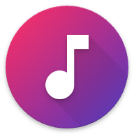
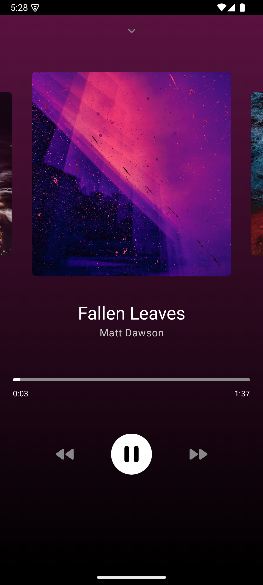
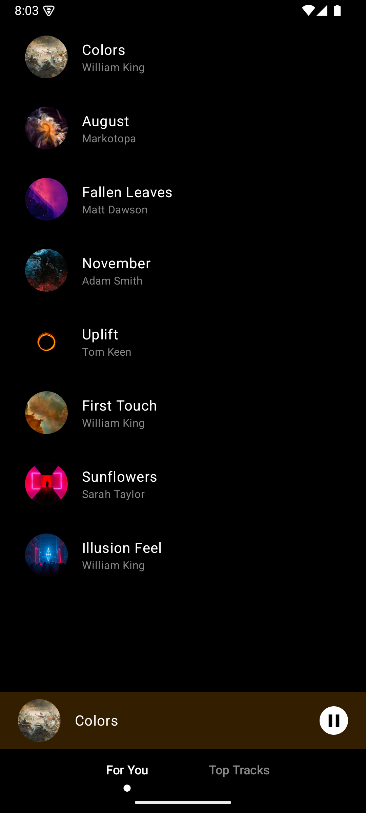
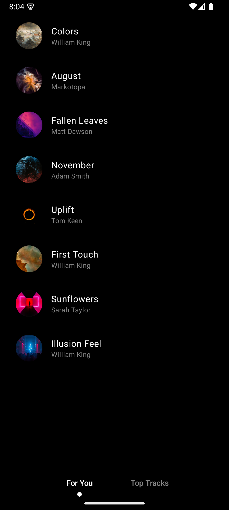

# Music Player

App made to stream music from an API

## Features

-   Adaptive gradient background based on the song's cover image
-   Utilized Rest API to fetch and display the song lists from API
-   Implemented a tab view to showcase "For You" and "Top Tracks
-   Integrated music playback controls (play, pause, next, previous)
-   Swipe gestures for song changes, player minimization and tab navigation
-   Enhanced app with morph animations for different view
-   Haptic feedback for tab changes and play/pause actions

## Screenshots

<table>
  <tr>
    <td></td>
    <td></td> 
  </tr>
  <tr>
    <td></td>
  </tr>
</table>

## Technologies Used

-   Kotlin
-   Jetpack Compose
-   Android Studio

## Contributing

I welcome contributions from the community! If you'd like to contribute to the app, please fork the repository, create a branch, and submit a pull request with your changes. Make sure to follow the code style and commit message conventions outlined in the repository.

## Contact

If you have any questions, suggestions, or feedback, please feel free to contact me at shenmareparas@gmail.com or create an issue in the repository. I'd love to hear from you!

## Enjoy the App!